# About these notes {.unnumbered}

These notes go along with the Week 1 lectures. They follow the same order as the slides, but they fill in the reasoning between slides, add worked examples, and end with some practice problems. Boxes marked **Key result** hold the equations you should know well. Boxes marked **Worked example** show how to use them with real numbers. Boxes marked **Going further** are optional material beyond what the lectures require. These notes were partially prepared with assistance from generative artificial intelligence, but all mistakes are the responsibility of the human author.

::: reading
**Reading.** Serway and Jewett, *Physics for Scientists and Engineers with Modern Physics* (10th edition), Sections 39.1 to 39.4. You can reach the book electronically from the Week 1 tab of the PHAS0004 Moodle page.
:::

## Aims of Week 1 {.unnumbered}

By the end of this week you should be able to:

- outline the history of the competing wave and particle pictures of light;
- explain why interference experiments (Young's double slit and the Mach-Zehnder interferometer) show that light behaves as a wave;
- describe three experimental measurements that the wave picture cannot explain: black-body radiation, the photoelectric effect and Compton scattering;
- use the photon energy $E = hf$ and photon momentum $p = h/\lambda$ in calculations;
- explain what happens when single photons meet a beam splitter or an interferometer, and why light is neither purely a wave nor purely a particle;
- see why these results call for a new physical theory: quantum mechanics.

\newpage 

# Light: a wave or a particle?

## A brief history

People have argued about the nature of light for more than two thousand years. In Classical Greece (around 350 BC) **Aristotle** argued that light and colour reach the eye from the objects we see, which went against the popular idea of the time that the eye sends out rays of its own. Around 1000 AD, in Fatimid Egypt, **Ibn al-Haytham** did careful experiments showing that light travels in straight lines. He treated light as a stream of particles and used this picture to study reflection and refraction. He used this to explain effects such as the Moon looking larger near the horizon. His *Book of Optics* shaped European optics for centuries.

In the late seventeenth century there were a series of rapid (at least compated to the previous two thousand years) developments:

- **Ole Rømer (1676)** timed the eclipses of Jupiter's moon Io. Their timing drifted with the Earth-Jupiter distance, which showed that **light has a finite speed**.
- **Christiaan Huygens (1678)** proposed that **light is a wave**. In his picture every point on a wavefront acts as a source of new spherical "wavelets".
- **Isaac Newton (*Opticks*, 1704)** argued that **light is a stream of particles** ("corpuscles").

The trouble was that both theories could explain everything known at the time: a finite speed of light, sharp shadows, reflection and refraction. For a definitive answer there needed to be an experiment that could tell the difference between a wave-like and particle-like light.

## What tells a wave apart from a particle?

Throw two stones into a pond and watch the ripples cross. Where two crests meet, the water rises higher. Where a crest meets a trough, the two cancel and the water stays flat. This is **interference**, and only waves do it. Two streams of particles simply add: two balls in the same place are just two balls. They never cancel each other out.

So if light shows interference, it must be a wave.

# Interference: evidence that light is a wave

## Diffraction

When a plane wave meets a narrow opening, the wave that comes out spreads into the region behind the opening instead of travelling straight on. This is **diffraction**, and Francesco Grimaldi first described it for light in the 1660s. The spreading is only significant when the opening is comparable in size to the wavelength. Visible light has wavelengths of about 400-700 nm, which is why we don't usually notice light diffracting around everyday objects.

## Young's double-slit experiment

In 1801 **Thomas Young** conceived the experiment that settled the argument for most of the nineteenth century.

**One slit.** Shine collimated monochromatic light (parallel rays of a single wavelength) at an opaque sheet with one small slit, and look at a screen beyond it. You see a single blurred band of light. Both models can explain this. In the wave model the slit diffracts the wave, which spreads out. In the particle model the particles pass through the slit, some are deflected slightly at its edges, and they land in a smeared-out distribution.

**Two slits.** Now open a second slit next to the first.

- The **particle model** predicts that each particle goes through one slit or the other. The screen should show the sum of two smeared-out single-slit distributions: one broad, slightly wider band.
- The **wave model** predicts that the waves from the two slits overlap and interfere. The screen should show a series of **bright and dark fringes**.

Experiments show the fringes.

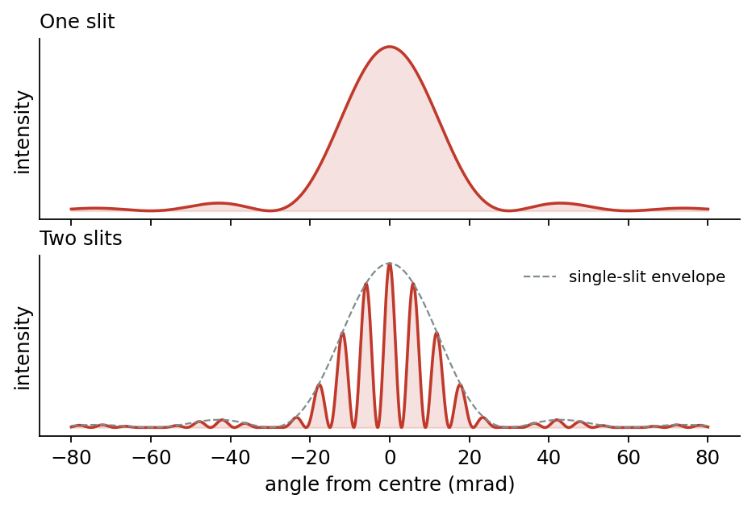{width=80%}

## Constructive and destructive interference

Why are there bright and dark fringes? Pick a point on the screen and look at the two waves arriving there, one from each slit.

- At a **bright fringe**, a peak from the top slit arrives at the same moment as a peak from the bottom slit. The waves are **in phase** and add to give a bigger wave. This is **constructive interference**.
- At a **dark fringe**, a peak from the top slit arrives with a trough from the bottom slit. The waves are **in antiphase** and cancel. This is **destructive interference**.

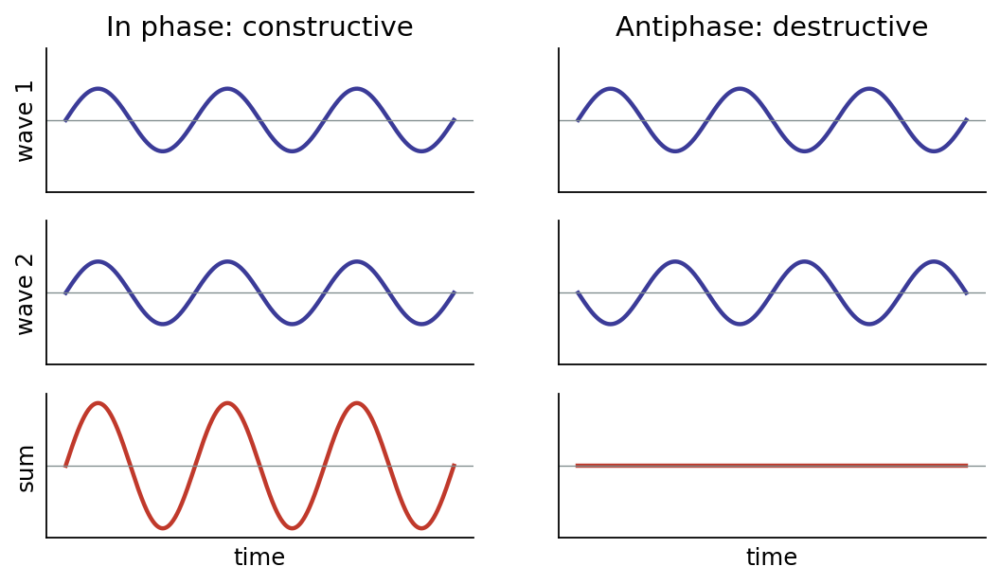{width=85%}

Now let's imagine an experimental setup where we cover one of the two slits:
- The total amount (intensity) of light on the screen will **decrease** (much like if you close the curtains over one of two windows in a room)
- At places where there are **bright fringes** the amount of light will **decrease**
- At places where there are **dark fringes** the amount of light will **increase**

This is strong evidence against Newton's particle model. The light arriving at each point on the screen has to "know" about *both* slits, because closing one slit makes the fringes vanish. It seems obvious that a particle can only go through one slit, so a particle model is ruled out. We'll come back to that word "obvious" later in the notes.

## Phase shifts

When two waves that started in step end up out of step, we say a **phase shift** has occurred between them. It's convenient to measure a phase shift as a fraction of a wavelength:

| Phase shift | In radians | Result when the waves are combined |
|---|---|---|
| 0 | 0 | in phase: constructive interference |
| $\lambda/4$ | $\pi/2$ | partial interference |
| $\lambda/2$ | $\pi$ | antiphase: destructive interference |
| $\lambda$ (one whole wavelength) | $2\pi$ | back in phase: constructive interference |

A shift of one whole wavelength looks exactly like no shift at all, since each peak just lines up with the next peak along. In general a phase shift of $\Delta$ (as a length) corresponds to a phase angle
$$
\delta = 2\pi\,\frac{\Delta}{\lambda}.
$$

In optics, phase shifts have two main causes:

1. **A difference in path length.** If one wave travels an extra distance $\Delta$ to reach a point, it falls behind by $\Delta$.
2. **Passing through a material** such as glass or a crystal. Light travels more slowly in the material, so it builds up extra phase compared with light that stays in air.

A phase shift is always a **relative** property: we can only say that one beam is shifted *relative to* another.

::: keyresult
**Key result: the double-slit condition.** Slits a distance $d$ apart send light towards a point at angle $\theta$ from the centre line. The path difference between the two waves is $\Delta = d\sin\theta$. So:
$$
\begin{aligned} \text{bright fringes:}&\quad d\sin\theta = m\lambda, \\ \text{dark fringes:}&\quad d\sin\theta = \left(m+\frac{1}{2}\right)\lambda, \qquad m = 0, \pm1, \pm2, \dots \end{aligned}
$$
For small angles on a screen a distance $L$ away, the bright fringes are evenly spaced by $\;\Delta y = \lambda L / d$.
:::

::: example
**Worked example: fringe spacing.** Red light with $\lambda = 600$ nm passes through two slits $d = 0.10$ mm apart onto a screen $L = 1.0$ m away. The fringe spacing is
$$
\Delta y = \frac{\lambda L}{d} = \frac{(600\times10^{-9}\ \text{m})(1.0\ \text{m})}{0.10\times10^{-3}\ \text{m}} = 6.0\ \text{mm}.
$$
That's easy to see by eye. Young's experiment works because $L/d$ is large enough to magnify the tiny wavelength of light into a visible pattern.
:::

## Intensity and amplitude

In classical physics, light is a travelling disturbance of the electric and magnetic fields. At a fixed point, the electric field oscillates in time, taking both **positive and negative** values. Its largest departure from zero is the **amplitude**, $E_0$.

Our eyes and detectors don't respond to the field itself. They respond to the **intensity**: the power carried per unit area (units W m$^{-2}$). The intensity is proportional to the **square** of the field, averaged over time:
$$
I \propto \langle E^2 \rangle = \frac{1}{2} E_0^2 .
$$
Because it's a square, the intensity is **never negative**, though it can be zero. (The energy is actually carried by both the electric and the magnetic field, but the two are locked together, so tracking $E$ alone is enough.)

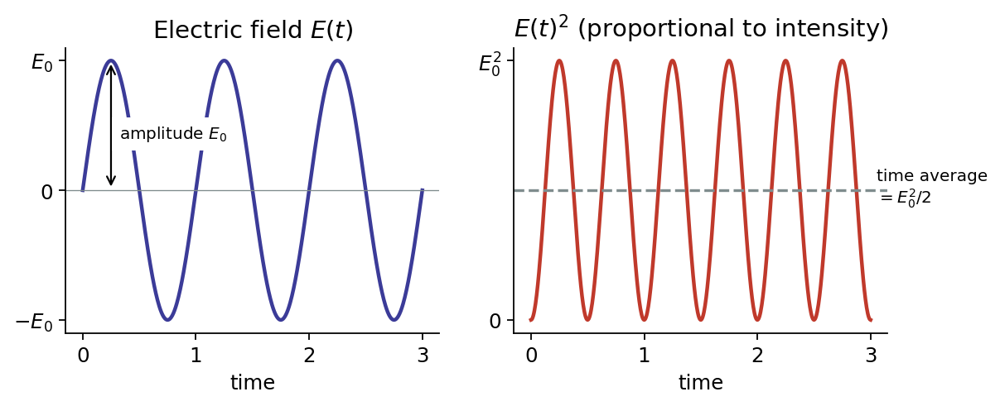{width=90%}

This leads to the most important idea in this section:

::: keyresult
**Key idea: interference happens at the level of amplitudes.** To find what we observe, we first **add the fields** (amplitudes) of the overlapping waves, and only *then* **square** the total to get the intensity. For two waves of equal intensity $I_0$ with a phase difference $\delta$:
$$
E_1 = A_0 \cos (\omega t) \; \; E_2 = A_0 \cos \left(\omega t + \delta \right)
$$

$$
I = \left|E_1 + E_2\right|^2 \;\Rightarrow\; I = 4 I_0 \cos^2\!\left(\frac{\delta}{2}\right)
$$

using $$ \cos A + \cos B = 2 \cos \left(\frac{A+B}{2}\right) \cos\left(\frac{A-B}{2}\right). $$

In phase ($\delta = 0$) this gives $4I_0$, not $2I_0$. In antiphase ($\delta = \pi$) it gives zero. If we had added intensities instead, we would always get $2I_0$ and there would be no fringes. Energy is still conserved: the light missing from the dark fringes turns up in the bright ones. 
:::

We will see the same rule, *add first, then square*, come back in quantum mechanics.

# The Mach-Zehnder interferometer

Young's experiment involves a continuous range of paths and angles. The **Mach-Zehnder interferometer** makes the same "light is a wave" argument with just **two** paths. That makes it much easier to analyse, and it will be the main tool we use to think about single photons later.

## The components

**Beam splitter.** A "semi-silvered mirror". Most reflecting surfaces reflect some light and transmit the rest (you can often see a faint reflection in a window). A pefect beam splitter is designed to **transmit 50%** and **reflect 50%** of the incoming intensity.

Reflection at a beam splitter can also cause a **phase shift**. This follows from energy conservation. The reflected and transmitted beams must be arranged so that the total outgoing power always equals the incoming power, whatever beams come in. In this module we always use a **symmetric beam splitter**, for which on either side:

- transmission causes **no phase shift**;
- reflection causes a **$\lambda/4$ phase shift** (a phase angle of $\pi/2$).

::: aside
**An unfortunate complication.** Some real beam splitters are *asymmetric*. Reflection from one side gives no phase shift, and reflection from the other side gives a $\lambda/2$ shift. Transmission still gives no shift. This convention appears in some textbooks. It changes the bookkeeping but not the physics: the difference in phase between the two paths, which is all that matters, comes out the same. In PHAS0004 we will always use the symmetric convention.
:::

**Mirror.** Reflects all the light, transmits none, and (in our convention) causes **no phase shift**.

**Detector.** Measures the power of the light falling on it, in Watts (joules per second).

## The full interferometer

Light enters at the first beam splitter (BS1), which splits it into two beams. One beam takes the **upper path** (reflected at BS1, then off a mirror). The other takes the **lower path** (transmitted at BS1, then off a mirror). The two beams recombine at a second beam splitter (BS2), and two detectors watch the two possible final locations.

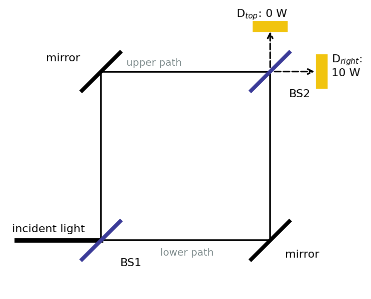{width=65%}

Classically you might expect each detector to get 5 W. Experimentally, **all the light goes to the right-hand detector and none goes to the top detector**. This is interference, and we can see why by counting the phase shifts along each path.

**Right detector.**

- Upper path: reflected at BS1 ($\lambda/4$), mirror (0), transmitted at BS2 (0). Total $\lambda/4$.
- Lower path: transmitted at BS1 (0), mirror (0), reflected at BS2 ($\lambda/4$). Total $\lambda/4$.

Each path has one reflection and one transmission at a beam splitter, so both paths have the **same phase shift**. The waves arrive in phase and interfere **constructively**.

**Top detector.**

- Upper path: reflected at BS1 ($\lambda/4$), mirror (0), reflected at BS2 ($\lambda/4$). Total $\lambda/2$.
- Lower path: transmitted at BS1 (0), mirror (0), transmitted at BS2 (0). Total 0.

The paths differ by $\lambda/2$. The waves arrive in **antiphase** and interfere **destructively**: no light at all.

This is exactly the kind of behaviour a particle model can't explain. The light at each detector "knows" about both paths, but a classical particle can only travel along one of them.

## Blocking one path

Now what happens when we put an absorbing block in the upper path.

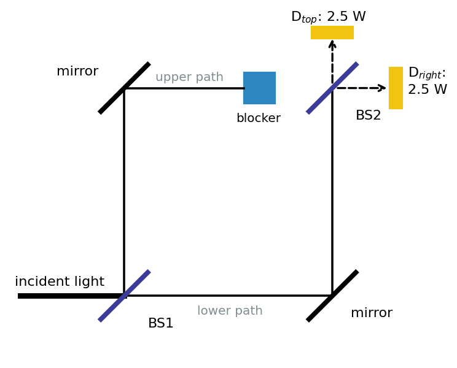{width=65%}

BS1 sends 5 W along each path. The 5 W on the upper path is absorbed. The 5 W on the lower path reaches BS2, which splits it into 2.5 W towards each detector. **Both detectors change**: the top one goes from 0 to 2.5 W, and the right one goes from 10 W to 2.5 W. With only one path open there is nothing to interfere with, so the light behaves much more like particles simply being shared out at random. **Interference happens only when wave-like light travels both paths.**

::: further
**Going further: unequal arms.** Suppose we make the upper path longer by a small extra distance $\Delta L$. That adds a phase difference $\delta = 2\pi\,\Delta L/\lambda$ between the arms, and the output intensities become
$$
I_\text{right} = I_\text{in}\cos^2\!\left(\frac{\pi\,\Delta L}{\lambda}\right), \qquad I_\text{top} = I_\text{in}\sin^2\!\left(\frac{\pi\,\Delta L}{\lambda}\right).
$$
The two always add up to $I_\text{in}$, so energy is conserved. Moving one mirror by just $\lambda/4$ (about 150 nm) sends *all* the light to the top detector. This extreme sensitivity to path length is why interferometers are used for precision measurement. The LIGO gravitational-wave detectors are giant interferometers that detect arm-length changes of less than $10^{-18}$ m.
:::

# Problems with the wave picture

Young's double slit and the Mach-Zehnder interferometer seem to give irrefutable evidence that light is a wave. By the end of the nineteenth century, Maxwell's theory of electromagnetism described light as an electromagnetic wave with great success.

But physics turned out to be more interesting than that. In the first decades of the twentieth century, strong evidence appeared that the wave picture is **not the whole story**. It came from three places:

1. **Black-body radiation**
2. **Photoelectric effect**
3. **Compton scattering**

\newpage

# Black-body radiation

## What is a black body?

A **black body** is an idealised object that **absorbs all the light that falls on it**. It then re-emits radiation whose spectrum depends only on its temperature, because the light has come into thermal equilibrium with the matter. A good laboratory version is a closed box (a "cavity") with a small hole. Light that enters the hole bounces around inside and is almost certainly absorbed before it can escape, so the hole looks perfectly black. When the box is hot, the light leaking out of the hole is black-body radiation.

Stars, glowing embers and red-hot metal are all good approximations to black bodies. Nineteenth-century physicists studied black-body radiation because they wanted to understand how matter absorbs and emits light.

## Two experimental laws

Careful measurements at different temperatures established two laws.

::: keyresult
**Stefan's law.** The total power radiated by a black body is
$$
P = \sigma A T^4 ,
$$
where $A$ is the surface area (m$^2$), $T$ is the absolute temperature (K) and $\sigma = 5.67\times10^{-8}\ \text{W m}^{-2}\,\text{K}^{-4}$ is the Stefan-Boltzmann constant.

**Wien's displacement law.** The wavelength at which the emission peaks is inversely proportional to temperature:
$$
\lambda_\text{max} = \frac{2.9\times10^{-3}\ \text{m K}}{T}.
$$
:::

Wien's law is often summed up as "**the hotter, the bluer**". A star's colour tells you its surface temperature: red stars are cool (around 3000 K) and blue-white stars are hot (above 10,000 K).

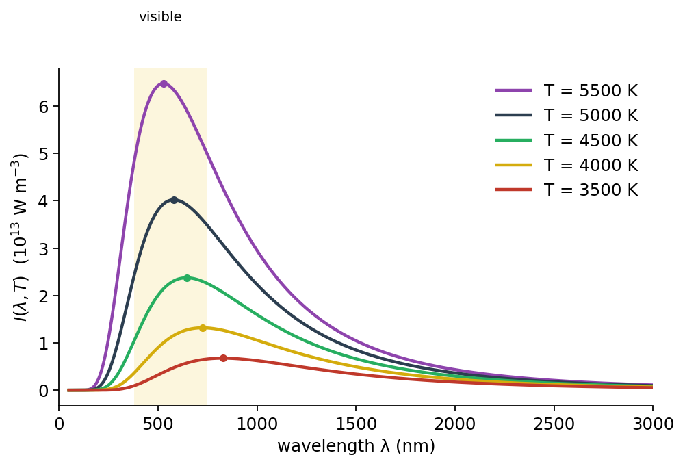{width=80%}

::: example
**Worked example: the Sun.** The Sun's surface temperature is about $T = 5800$ K and its radius is $R = 6.96\times10^{8}$ m. Its peak wavelength is
$$
\lambda_\text{max} = \frac{2.9\times10^{-3}}{5800}\ \text{m} = 500\ \text{nm},
$$
in the green part of the visible spectrum. Its total power output is
$$
P = \sigma (4\pi R^2) T^4 = (5.67\times10^{-8})(4\pi)(6.96\times10^{8})^2 (5800)^4 \approx 3.9\times10^{26}\ \text{W}.
$$
By comparison, your body at $T \approx 310$ K radiates most strongly at $\lambda_\text{max} \approx 9\ \mu$m, in the infrared. This is what thermal cameras detect.
:::

## Classical physics fails: the ultraviolet catastrophe

Can classical physics explain the *shape* of the spectrum? Rayleigh and Jeans combined thermodynamics with the wave model of light and derived
$$
I(\lambda, T) = \frac{2\pi c k T}{\lambda^4},
$$
where $c$ is the speed of light and $k$ is Boltzmann's constant. Here $I(\lambda,T)$ is the power emitted per unit area per unit wavelength (units W m$^{-3}$). The derivation rests on one key assumption: **at every wavelength, light energy is absorbed and emitted continuously**, in arbitrarily small amounts.

The Rayleigh-Jeans law agrees with experiment at long wavelengths, but it fails badly at short ones:

- it doesn't fit the data;
- it has no peak at all;
- as $\lambda \to 0$ it predicts **infinite intensity**, so any warm object would emit an infinite amount of ultraviolet light.

This became known as the **ultraviolet catastrophe**.

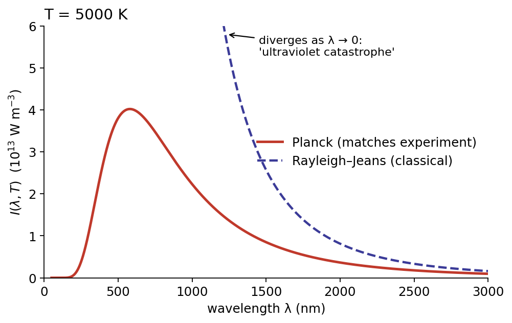{width=80%}

## Planck's solution (1900)

Max Planck found a formula that fitted the data perfectly. His starting point was what he himself saw as a mathematical trick:

- assume that light energy is absorbed and emitted only in **discrete units**, or "quanta";
- give each unit an energy proportional to its frequency:

::: keyresult
$$
E = hf, \qquad f = \frac{c}{\lambda},
$$
where $f$ is the frequency and $h$ is a new constant of nature, to be found from experiment.
:::

The result is **Planck's law**:
$$
I(\lambda, T) = \frac{2\pi h c^2}{\lambda^5}\,\frac{1}{e^{hc/\lambda k T} - 1}.
$$
You will derive this in the second-year module *Statistical Physics of Matter*. For now, notice two things.

First, at long wavelengths the exponent $x = hc/\lambda kT$ is small, so $e^{x} - 1 \approx x$. Planck's law then becomes
$$
I \approx \frac{2\pi h c^2}{\lambda^5}\cdot\frac{\lambda k T}{hc} = \frac{2\pi c k T}{\lambda^4},
$$
which is exactly the Rayleigh-Jeans law. The classical result is correct where quantisation doesn't matter.

Second, at short wavelengths each quantum $hf$ is large compared with the typical thermal energy $kT$. The factor $e^{hc/\lambda kT}$ then becomes enormous and switches the emission off. High-frequency quanta are simply too "expensive" to be emitted often, and this removes the ultraviolet catastrophe.

The value of $h$ controls the height and position of the peak, so fitting Planck's law to measured spectra gives a value for $h$.

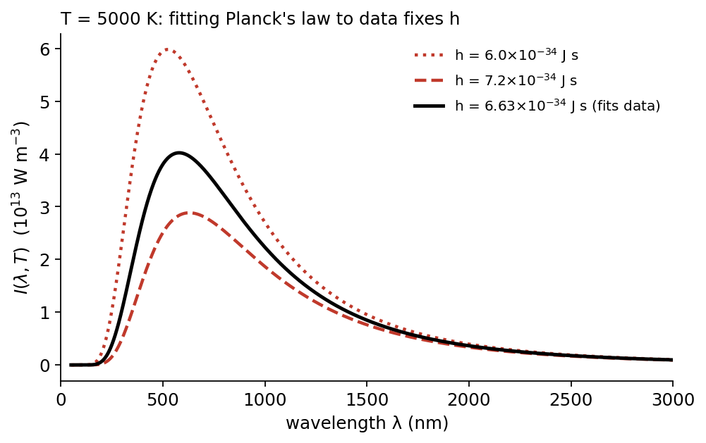{width=80%}

## Planck's constant

Modern experiments measured $h$ very precisely, and since 2019 the SI system of units has **defined** it to have the exact value
$$
h = 6.62607015\times10^{-34}\ \text{J s} \quad (\text{J Hz}^{-1}).
$$
We often use the **reduced Planck constant** ("h-bar") together with the angular frequency $\omega = 2\pi f$:
$$
\hbar = \frac{h}{2\pi} = 1.055\times10^{-34}\ \text{J s}, \qquad E = hf = \hbar\omega .
$$

The success of Planck's law was a mystery. Everyone believed light was a wave, yet Planck's derivation only worked if light behaved like discrete packets of energy. Planck himself hoped this was a feature of how matter emits and absorbs light, not a property of light itself. It took Einstein to take the idea seriously.

\newpage

# The photoelectric effect

## What is observed?

If we shine light onto a clean metal surface in a vacuum, with a collecting electrode nearby, under certain circumstances a current can flow: the light liberates electrons from the metal allowing them to flow to the electrode. Experiments show:

- when the light is **above a threshold frequency** $f_0$, a current flows **straight away**, and the magnitude of the current is proportional to the light intensity;
- when the light is **below the threshold frequency**, **no current flows, however intense the light**.

The wave picture can not explain this. In a classical wave, the energy delivered depends on the *intensity*, not the frequency (think of the sea: waves with large amplitudes carry more energy than waves with small amplitudes). A bright enough red light should eventually shake electrons loose. And a very dim light should take some time to build up enough energy in an electron before it escapes. Neither happens.

## Einstein's explanation (1905)

Einstein proposed that we **take Planck's model seriously**:

- light itself consists of particles of energy $E=hf$, these particles we now call **photons**;
- an electron can absorb energy from only **one photon at a time**;
- each electron needs a minimum energy, the **work function** $\phi$, to escape from the metal;
- photons with too little energy (too low in frequency) can't eject an electron, no matter how many of them arrive.

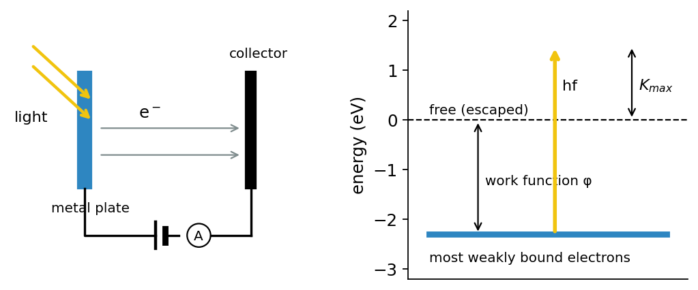{width=85%}

Energy conservation for one photon absorbed by one electron gives Einstein's photoelectric equation:

::: keyresult
$$
K_\text{max} = hf - \phi ,\qquad \text{threshold: } f_0 = \frac{\phi}{h}.
$$
:::

If the intensity of the light increases then more photons will arrive each second, this means more electrons can be liberated each second and therefore the current gets larger. However, since the energy of the photon depends on frequency the maximum kinetic energy of the liberated electrons also depends on the frequency. If a reverse "stopping voltage" $V_s$ is applied to the collector, the current falls to zero when $eV_s = K_\text{max}$, which gives a direct way to measure $K_\text{max}$.

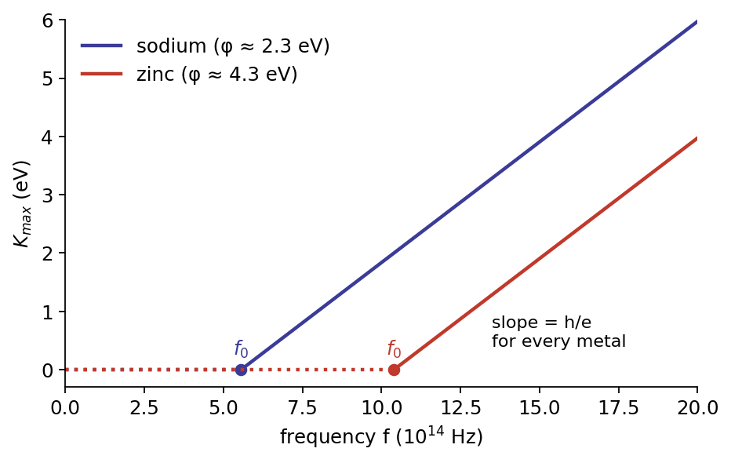{width=75%}

Einstein received the 1921 Nobel Prize in Physics "especially for his discovery of the law of the photoelectric effect".

::: example
**Worked example: sodium.** Sodium has a work function of about $\phi = 2.3$ eV. The combination $hc = 1240$ eV nm is handy here. For violet light with $\lambda = 400$ nm:
$$
E_\text{photon} = \frac{hc}{\lambda} = \frac{1240\ \text{eV nm}}{400\ \text{nm}} = 3.1\ \text{eV}, \qquad K_\text{max} = 3.1 - 2.3 = 0.8\ \text{eV}.
$$
The threshold wavelength is $\lambda_0 = hc/\phi = 1240/2.3 \approx 540$ nm (green). Red light at 650 nm, however bright, ejects no electrons from sodium.
:::

## Historical sidenote: Millikan (1916)

Robert Millikan didn't believe Einstein's photon hypothesis. He spent about ten years on precise photoelectric measurements, hoping to disprove it. He ended up confirming the linear relationship between $K_\text{max}$ and $f$, and he obtained one of the best early values of $h$. Even so, his 1916 paper still called the idea *reckless*:

> "This hypothesis may well be called reckless first because an electromagnetic disturbance which remains localized in space seems a violation of the very conception of an electromagnetic disturbance, and second because it flies in the face of the thoroughly established facts of interference."
>
> — R. A. Millikan, *A direct photoelectric determination of Planck's "h"*, Physical Review (1916)

Millikan's worry, that photons seem to contradict interference, is exactly the puzzle we come back to at the end of these notes.

# Photon momentum

## Light carries momentum

Even classically, light carries momentum: shine light on a surface and it pushes. You'll derive this properly in second-year electromagnetic theory. The push is called **radiation pressure**, and for light that is fully absorbed it is
$$
P_\text{rad} = \frac{I}{c},
$$
where $I$ is the intensity. Radiation pressure is tiny, but it is enough to propel a **solar sail**: a very large, very thin reflective sheet that uses sunlight to accelerate a spacecraft.

What does this imply for photons? It means **photons must carry momentum too**. Let $\Phi$ be the photon flux, the number of photons crossing unit area per second. Then the intensity is $I = E\Phi$ (energy per photon times photon flux), and
$$
P_\text{rad} = \frac{I}{c} = \frac{E}{c}\,\Phi .
$$
Pressure is the rate at which momentum is delivered per unit area, so each photon must bring a momentum $p = E/c$.

::: further
**Going further: compatible with special relativity**
Einstein's special relativity (1905) gives the same answer from a different direction. In relativity, a particle's energy and momentum are related by
$$
E^2 = p^2c^2 + m^2c^4 .
$$
A particle travelling at the speed of light must be **massless** ($m = 0$). A massless particle still carries momentum: $p = E/c$. The photon is a massless particle, so combining this with $E = hf$ gives:
:::

::: keyresult
**Photon energy and momentum.**
$$
E = hf = \hbar\omega, \qquad p = \frac{E}{c} = \frac{hf}{c} = \frac{h}{\lambda} = \hbar k,
$$
where $k = 2\pi/\lambda$ is the **wavevector** (strictly its magnitude, the wavenumber).
:::

Notice how these two equations tie the particle properties (energy $E$ and momentum $p$) to the wave properties (frequency $f$ and wavelength $\lambda$), with Planck's constant as the link.

::: example
**Worked example: sunlight on a solar sail.** Near the Earth, sunlight has an intensity of about $I = 1360$ W m$^{-2}$. On a perfectly absorbing sail the radiation pressure is
$$
P_\text{rad} = \frac{I}{c} = \frac{1360}{3.0\times10^8} = 4.5\times10^{-6}\ \text{Pa}.
$$
A perfectly reflecting sail feels twice this, because each photon's momentum is reversed rather than just stopped. A 1000 m$^2$ reflecting sail therefore feels a force of about 9 mN. That's tiny, but in space it acts continuously and without using any fuel.
:::

# The Compton effect

## A cleaner test

The photoelectric effect involves electrons bound inside a metal, which complicates the details. Arthur Compton looked instead at how light interacts with **single, nearly free charged particles**. Here classical electromagnetism and the photon picture make **very different predictions**. When **X-rays** (wavelengths around 0.01-1 nm) hit a metal, they scatter off the loosely bound outer electrons, which behave almost as if they were free.

## The wave prediction: Thomson scattering

J. J. Thomson worked out how an electromagnetic *wave* should scatter from a charged particle:

- the incoming wave, with frequency $f = c/\lambda$, makes the electron **oscillate at the same frequency** $f$;
- the oscillating electron acts like a small antenna and **re-emits light at that same frequency** $f$ in all directions.

So the wave picture predicts that **the scattered light has exactly the same wavelength as the incoming light**, whatever the scattering angle.

## What Compton found (1923)

High-energy X-ray scattering experiments didn't match Thomson's predictions:

- back-scattered light was weaker than Thomson predicted;
- the scattered light was **shifted to a longer wavelength**, $\lambda' = \lambda + \Delta\lambda(\theta)$, and the size of the shift **depended on the scattering angle** $\theta$.

## Compton's proposal: photons as billiard balls

Compton took Planck and Einstein seriously. He treated the X-rays as a stream of **photons**, and he modelled each scattering event as an **elastic collision** between a photon and an electron, like the collision of two snooker balls. Both energy and momentum are conserved, with the photon's energy and momentum given by the Planck-Einstein expressions $E = hf$ and $p = h/\lambda$.

- **Energy conservation.** The electron recoils and carries off some kinetic energy. The scattered photon therefore has *less* energy than the incoming one, which means a lower frequency and a **longer wavelength**.
- **Momentum conservation.** The recoil direction of the electron is fixed by how much momentum the photon transfers. That depends on the scattering angle, so the energy loss depends on the angle too.

Working through the algebra gives the **Compton scattering formula**:

::: keyresult
$$
\lambda' - \lambda = \frac{h}{m_e c}\,(1 - \cos\theta),
$$
where $m_e$ is the electron mass and $\theta$ is the angle through which the photon is scattered. The quantity
$$
\frac{h}{m_e c} = 2.43\times10^{-12}\ \text{m} \approx 2\ \text{pm}
$$
is called the **Compton wavelength** of the electron.
:::

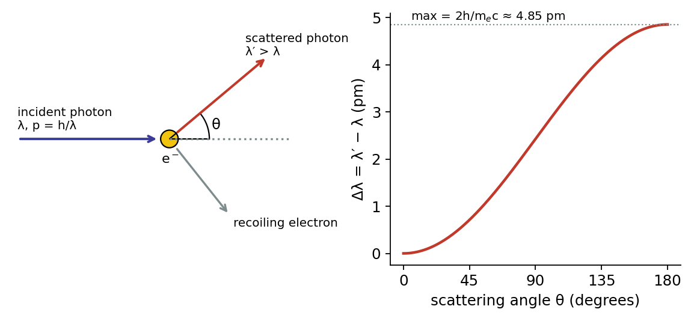{width=95%}

The shift is at most about 5 pm, whatever the incoming wavelength. It's only **measurable** when the wavelength itself is small, no more than a few orders of magnitude bigger than a picometre. For visible light ($\lambda \approx 500$ nm) the fractional change would be about one part in $10^5$, which explains why nobody noticed the effect until X-rays were used.

::: example
**Worked example: Compton's experiment.** Compton used molybdenum K$_\alpha$ X-rays with $\lambda = 0.0711$ nm $= 71.1$ pm. At a scattering angle of $\theta = 90°$, $\cos\theta = 0$, so
$$
\Delta\lambda = \frac{h}{m_ec}(1 - 0) = 2.43\ \text{pm}, \qquad \lambda' = 73.5\ \text{pm}.
$$
In his 1923 *Physical Review* paper Compton reported a measured shift of 0.022 Å (2.2 pm), against his prediction of 0.024 Å. He called this "a very satisfactory agreement". (1 Å $= 10^{-10}$ m $= 100$ pm.)
:::

::: further
**Going further: deriving the Compton formula.** Let the incoming photon have momentum $p = h/\lambda$ and the scattered photon $p' = h/\lambda'$. The electron starts at rest and recoils with momentum $\vec p_e$.

Momentum conservation gives $\vec p_e = \vec p - \vec p\,'$, so
$$p_e^2 = p^2 + p'^2 - 2pp'\cos\theta .$$
Energy conservation, using the relativistic energy of the electron, gives
$$pc + m_ec^2 = p'c + \sqrt{p_e^2c^2 + m_e^2c^4}.$$
Move $p'c$ to the left, square both sides and substitute for $p_e^2$. The $p^2$, $p'^2$ and $m_e^2c^4$ terms cancel, leaving
$$
m_e c\,(p - p') = p p' (1 - \cos\theta).
$$
Divide by $m_e c\,pp'$ and use $1/p = \lambda/h$:
$$
\frac{1}{p'} - \frac{1}{p} = \frac{1 - \cos\theta}{m_e c} \quad\Rightarrow\quad \lambda' - \lambda = \frac{h}{m_e c}(1-\cos\theta).
$$
:::

Compton scattered X-rays from a range of metals. In every case the measured wavelength shift closely matched his theory and disagreed with Thomson's wave prediction. He shared the 1927 Nobel Prize in Physics for this work.

\newpage

# A particle and a wave?

We now seem to have a contradiction:

- Einstein's photoelectric argument and Compton's scattering experiments are **unambiguous**: light as a **particle** has to be taken seriously.
- Yet interference experiments, from Young to Mach-Zehnder, show just as clearly that **light is a wave**.

How can light be both? To find out, we need to look at what happens when there is only **one photon at a time**. The answer will need a new theory: **quantum mechanics**.

# Towards single photons

## Turning down the power

Shine a 10 W laser beam at a screen and you see a bright spot. Turn the power down to 5 W, then to 1 W, and the spot gets dimmer. Classically we could keep going for ever, and the spot would just get fainter and fainter.

But if light is made of photons, there is a smallest possible "amount" of light. Consider yellow light:
$$
f \approx 5\times10^{14}\ \text{Hz}, \qquad E = hf \approx (6.6\times10^{-34})(5\times10^{14}) \approx 3\times10^{-19}\ \text{J}.
$$
A 1 W beam therefore carries about $3\times10^{18}$ photons per second. Now make the beam so weak that it carries **one photon per second on average**, which is an average power of just $hf \approx 3\times10^{-19}$ W.

What we see changes completely:

- detection is **no longer continuous**;
- instead, a sensitive detector gives individual **"clicks"**, each one a single photon arriving;
- the clicks come at **random** times, on average once per second.

## Photons at a beam splitter

With an ordinary beam, a 50:50 beam splitter sends half the power each way: a 10 W beam becomes two 5 W beams. What happens to **one** photon?

A photon can't be divided. We never see half a click in each detector. Instead, each photon is detected in **one output or the other**:

- with **50% probability**, the transmitted detector clicks and the reflected one doesn't;
- with **50% probability**, the reflected detector clicks and the transmitted one doesn't.

Which one happens for a particular photon is completely random. Over many photons, half turn up in each beam, and the 50:50 probabilities match the 50:50 intensities of the classical beam.

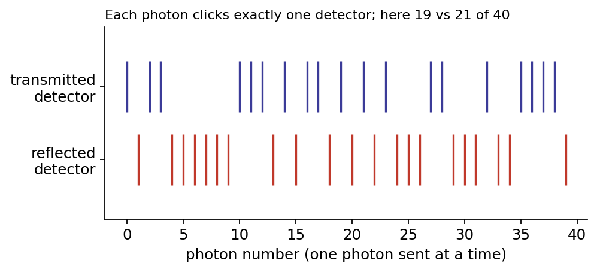{width=80%}

## Classical limit and quantum limit

- **Quantum limit.** With *small* numbers of photons, quantum behaviour dominates and quantum mechanics is **essential**.
- **Classical limit.** With *very large* numbers of photons, the random quantum behaviour "averages away", and classical physics is a **very good approximation**.

A typical laser pointer sends out around $10^{15}$ or more photons per second, so the randomness of individual clicks is completely invisible and the beam behaves like a smooth classical wave. But even with huge numbers of photons, some phenomena can't be described classically: black-body radiation, the photoelectric effect and Compton scattering.

We can think of classical behaviour as **many repetitions of the quantum behaviour**. This gives us a rule connecting the two:

::: keyresult
**The single-photon probability rule.** The probability that a single photon is detected at a given detector is proportional to the intensity that detector would receive in the equivalent classical experiment.

For example, suppose an interferometer lit by a laser sends 9.5 W to one detector and 0.5 W to the other. Then a single photon sent through the same interferometer clicks the first detector with probability 95% and the second with probability 5%.
:::

## Young's double slit, revisited

With classical light, Young's experiment gives the familiar fringes. What happens if we send photons through **one at a time**?

Each photon lands at a single, apparently random point on the screen: a particle-like event. But as more and more photons arrive, the random dots build up into the **same interference pattern**. No photon lands at the dark fringes. Each individual photon, it seems, "went through both slits" and interfered with itself. This experiment has been done with single photons (for example at Leiden University), and also with electrons, atoms and even large molecules.

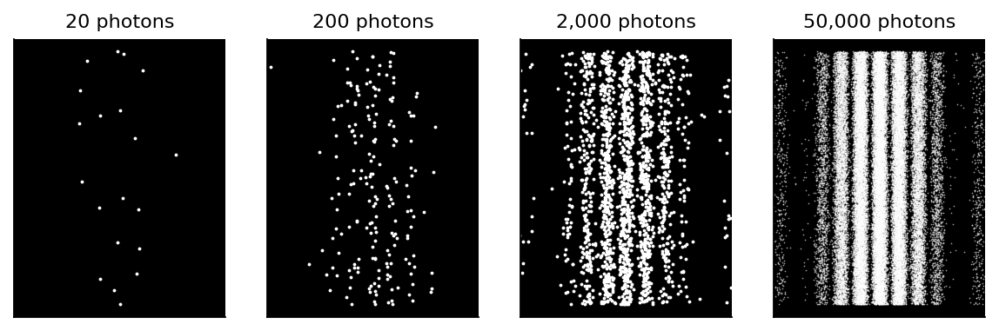{width=95%}

## The Mach-Zehnder interferometer, revisited

Now send single photons through the Mach-Zehnder interferometer.

**With one path blocked.** The outcomes are *stochastic*, or random. Using the probability rule and the classical powers found earlier (2.5 W, 2.5 W, and 5 W absorbed), the probabilities are:

- 25%: the top detector clicks;
- 25%: the right detector clicks;
- 50%: no click at all, because the photon was absorbed by the blocker.

**With both paths open.** Classically *all* the intensity reaches the right detector. So in the single-photon experiment, **the right detector always clicks and the top one never does**.

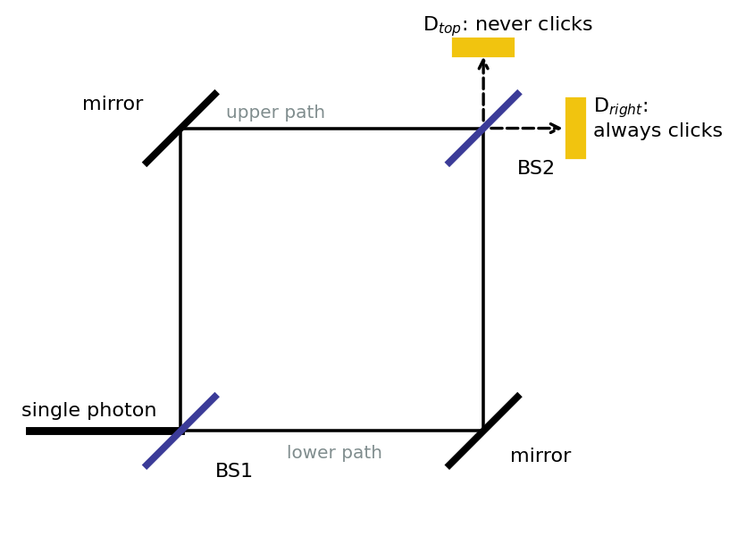{width=65%}

Think about what this means. If the photon simply took one path or the other, like a particle, we would be back in the blocked-path situation, and the top detector would click some of the time. It never does. The photon arriving at the right detector somehow "knew" that **two paths were available**.

# Wave-particle duality and measurement

## Wave-particle duality of the photon

The photon behaves both like a wave and like a particle:

- **when travelling**, a photon behaves like a **wave**. It explores both paths through the interferometer, and the contributions from the two paths interfere;
- **when detected**, a photon behaves like a **particle**. It is found in one place, and only one detector clicks.

Neither picture works on its own. The behaviour of single photons in a Mach-Zehnder interferometer **cannot be explained by wave-like or particle-like behaviour alone**.

## Measurement in quantum physics

This points to something deep: in quantum physics, **measurement has a profound effect on a system**.

- When it is **not observed**, the photon behaves like a **wave**.
- When it is **measured**, the photon behaves like a **particle**.

If we put a detector on one arm of the interferometer to find out which path the photon took, the interference disappears, just as if we had blocked a path. Getting information about "which way" destroys the wave-like behaviour. Over the coming weeks, quantum mechanics will give us a precise mathematical framework for this. It uses complex *probability amplitudes* that are added together and then squared, exactly like the classical rule "interference happens at the level of amplitudes".

## Quantum weirdness

If this all seems strange, you're in good company:

> "I think I can safely say that nobody understands quantum mechanics."
>
> — Richard Feynman

Erwin Schrödinger, one of the founders of the theory, is often quoted as saying of it: "I do not like it, and I am sorry I ever had anything to do with it."

\newpage

# Summary of Week 1

- The **wave model** is a very useful classical model of light. It explains **interference** in Young's double slit and the Mach-Zehnder interferometer, where we add amplitudes first and square afterwards.
- **Black-body radiation** and the **photoelectric effect** show that light is absorbed and emitted in **packets of energy**, or quanta.
- Planck's energy of a photon: $E = hf$.
- Einstein's momentum of a photon: $p = h/\lambda$.
- **Compton scattering** confirms that photons carry both energy and momentum in collisions with electrons.
- **Single-photon behaviour** can be observed: detection comes as discrete, random clicks.
- The **probability** of a photon reaching a detector is proportional to the light **intensity** at that detector in the equivalent classical experiment.
- The behaviour of single photons in a Mach-Zehnder interferometer can't be explained by wave-like or particle-like behaviour alone. We need **quantum mechanics**.

## Useful constants and relations {.unnumbered}

| Quantity | Value |
|---|---|
| Planck constant $h$ | $6.62607015\times10^{-34}$ J s (exact) |
| Reduced Planck constant $\hbar = h/2\pi$ | $1.055\times10^{-34}$ J s |
| Speed of light $c$ | $2.998\times10^{8}$ m s$^{-1}$ |
| Boltzmann constant $k$ | $1.381\times10^{-23}$ J K$^{-1}$ |
| Stefan-Boltzmann constant $\sigma$ | $5.67\times10^{-8}$ W m$^{-2}$ K$^{-4}$ |
| Electron mass $m_e$ | $9.109\times10^{-31}$ kg |
| Electron-volt | 1 eV $= 1.602\times10^{-19}$ J |
| Handy combination | $hc = 1240$ eV nm |
| Compton wavelength $h/m_ec$ | 2.43 pm |

\newpage

# Practice problems

::: problem
**1. Double slit.** 
Collimated monochromatic green light ($\lambda = 532$ nm) falls on two slits with a separation of 0.25 mm. The fringes are viewed on a screen 2.0 m away. 

(a) What is the spacing between bright fringes? 

(b) If the whole apparatus were immersed in water, where light travels more slowly and its wavelength is shorter, would the fringes move closer together or further apart?

:::

::: problem
**2. Intensities.** Two beams, each of intensity $I_0$, overlap. What is the total intensity if they are:

(a) in phase, 

(b) in antiphase, 

(c) a quarter-wavelength out of phase? 

Explain why (a) does not violate energy conservation.

:::

::: problem
**3. Mach-Zehnder bookkeeping.** In the interferometer described in these notes, 8 W of light enters. 

(a) How much power reaches each detector with both paths open? 

(b) With the *lower* path blocked? 

(c) One mirror is moved to lengthen the upper path by $\lambda/2$. Where does the light go now?

:::

::: problem
**4. Stars.** Betelgeuse has a surface temperature of about 3500 K, and Rigel about 12,000 K. 

(a) Find the peak emission wavelength of each and comment on their colours. 

(b) If the two stars had the same radius, what would be the ratio of their total power outputs?

:::

::: problem
**5. Photoelectric effect.** Light of wavelength 250 nm falls on a metal and ejects electrons with a maximum kinetic energy of 1.9 eV. 

(a) What is the work function of the metal? 

(b) What is the threshold wavelength? 

(c) The intensity of the light is doubled. What happens to the maximum kinetic energy and to the current?

:::

::: problem
**6. Counting photons.** A 1 mW green laser pointer emits light at 532 nm. 

(a) How many photons does it emit per second? 

(b) What is the momentum of each photon? 

(c) What force does the beam exert when it is completely absorbed by a surface?

:::

::: problem
**7. Compton scattering.** X-rays of wavelength 50.0 pm are scattered through 60° by free electrons. 

(a) What is the wavelength of the scattered X-rays? 

(b) What fraction of its energy did the photon lose? 

(c) Repeat (b) for visible light of wavelength 500 nm, and explain why the Compton effect wasn't discovered with visible light.

:::

::: problem
**8. Single photons.** A laser lights up an interferometer, and 7.5 W reaches detector A and 2.5 W reaches detector B. The laser is replaced by a single-photon source. 

(a) What is the probability that detector A clicks for a given photon? 

(b) If 1000 photons are sent, roughly how many clicks do you expect at B? 

(c) Could any single photon produce clicks at both A and B? Explain.
:::

\newpage

## Answers {.unnumbered}

1. (a) $\Delta y = \lambda L/d = (532\times10^{-9})(2.0)/(0.25\times10^{-3}) = 4.3$ mm. 

(b) The wavelength is shorter in water, so the fringes move closer together.

2. (a) $4I_0$. 

(b) 0. 

(c) A quarter wavelength means $\delta = \pi/2$, so $I = 4I_0\cos^2(\pi/4) = 2I_0$. 

In (a) the extra intensity at the bright fringes is balanced by zero intensity at the dark fringes. Averaged over the pattern, the intensity is $2I_0$, so energy is conserved.

3. (a) 8 W to the right detector and 0 W to the top one. 

(b) 2 W to each detector, with 4 W absorbed. 

(c) The extra $\lambda/2$ swaps constructive and destructive interference, so all 8 W now goes to the top detector.

4. (a) $\lambda_\text{max} \approx 830$ nm for Betelgeuse (in the near infrared, and the star looks red) and $\approx 240$ nm for Rigel (in the ultraviolet, and the star looks blue-white). 

(b) The power ratio is $(12000/3500)^4 \approx 140$, with Rigel the more powerful.

5. (a) The photon energy is $1240/250 = 4.96$ eV, so $\phi = 4.96 - 1.9 \approx 3.1$ eV. 

(b) $\lambda_0 = 1240/3.1 \approx 400$ nm. 

(c) $K_\text{max}$ stays the same. The current doubles, because twice as many photons eject twice as many electrons.

6. (a) $E = hc/\lambda = 3.73\times10^{-19}$ J, so the rate is $10^{-3}/3.73\times10^{-19} \approx 2.7\times10^{15}$ photons per second. 

(b) $p = h/\lambda = 1.25\times10^{-27}$ kg m s$^{-1}$. (c) $F = P/c = 3.3\times10^{-12}$ N. This is also (number of photons per second) × $p$.

7. (a) $\Delta\lambda = 2.43(1 - \cos 60°) = 1.21$ pm, so $\lambda' = 51.2$ pm. 

(b) $\Delta E/E = \Delta\lambda/\lambda' \approx 2.4\%$. 

(c) About $2.4\times10^{-6}$. For visible light the shift is only about 1 pm on 500 nm, far too small to detect with the spectroscopes of the time.

8. (a) 75%. 

(b) About 250 (with random fluctuations of roughly $\pm15$). 

(c) No. A photon can't be divided, so each photon produces exactly one click.
