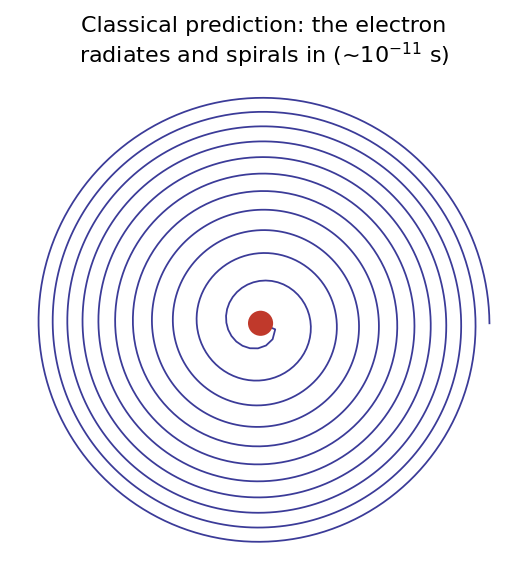
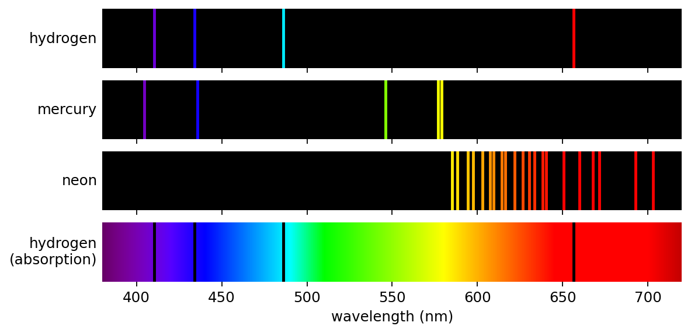
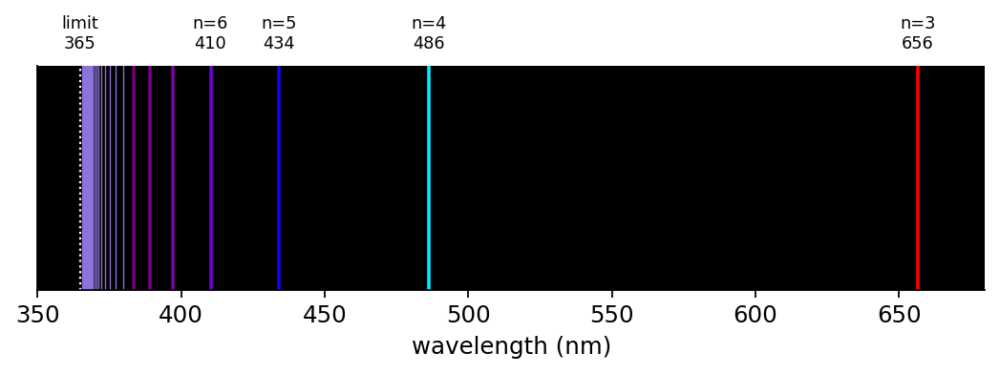
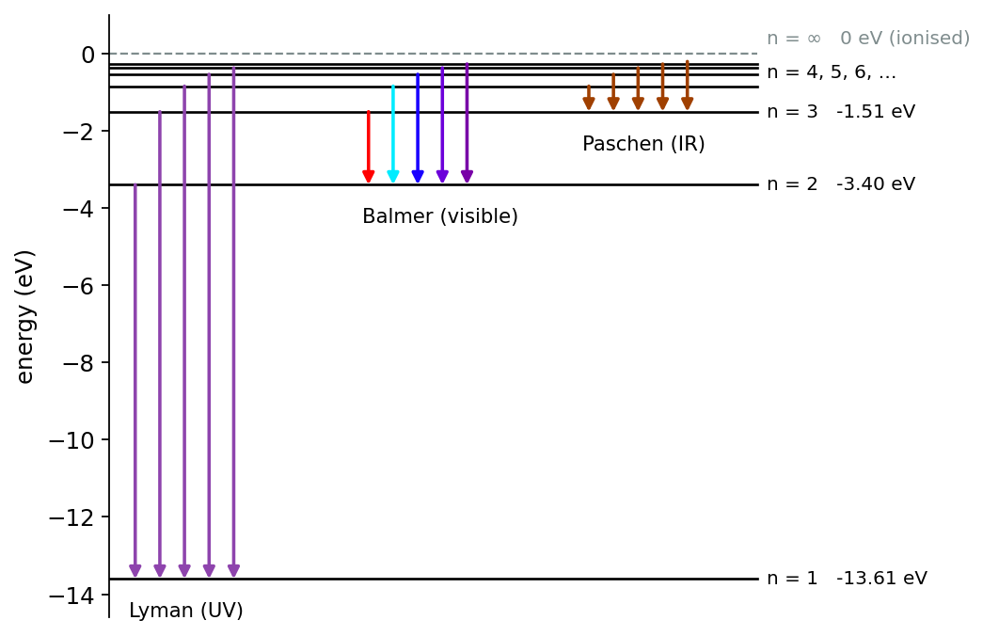
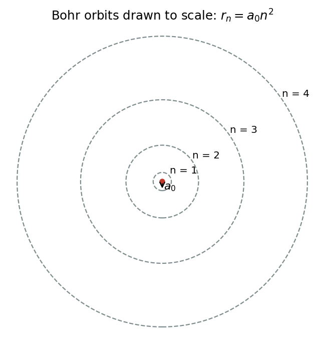
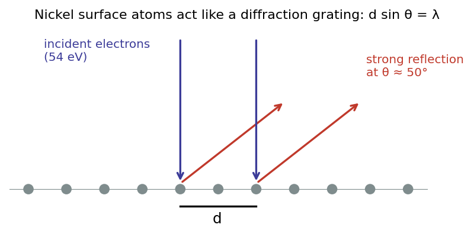
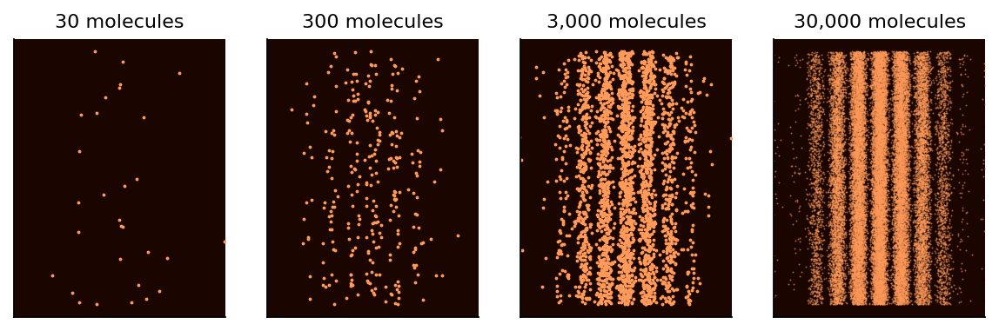
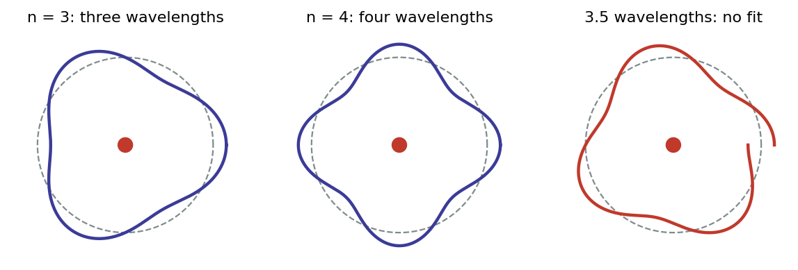

# About these notes {.unnumbered}

These notes go along with the Week 2 lectures. They follow the order of the slides, fill in the reasoning between them, and add worked examples and practice problems. As in Week 1, boxes marked **Key result** hold the equations you should know well. **Worked example** boxes show how to use them with numbers, and **Going further** boxes are optional.

::: reading
**Reading.** Serway and Jewett, *Physics for Scientists and Engineers with Modern Physics* (10th edition), Sections 39.5 and 39.7, and 41.1 to 41.3. You can reach the book electronically from the Week 2 tab of the PHAS0004 Moodle page.
:::

## Aims of Week 2 {.unnumbered}

By the end of this week you should be able to:

- trace the development of atomic models from Democritus to Bohr, and say what evidence drove each change;
- explain how Rutherford scattering revealed the atomic nucleus, and why the resulting planetary model cannot be the whole story;
- describe emission and absorption spectra, and use the Balmer and Rydberg formulas for hydrogen;
- connect spectral lines to discrete atomic energy levels using $E = hf$;
- derive the radii and energies of the Bohr model of hydrogen, and list its successes and failures;
- use the de Broglie relation $\lambda = h/p$, and describe the experiments that show matter behaving as a wave;
- explain how de Broglie waves give a physical meaning to Bohr's quantisation rule.

# Recap: light is both a wave and a particle

Last week ended with a puzzle. When single photons are sent one at a time through a Young's double slit, each photon lands at one point on the screen, but over time the dots build up an interference pattern. In the Mach–Zehnder interferometer with both paths open, a single photon always arrives at the same detector. It behaves as though it "knew" that two paths were available.

We summarised this as **wave–particle duality**:

- when **travelling**, a photon behaves like a **wave**, exploring every available path;
- when **detected**, it behaves like a **particle**, producing a single click in one place.

**Measurement** has a profound effect: unobserved, the photon acts as a wave; measured, it acts as a particle.

This week we turn from light to **matter**. We start by asking what atoms are made of, and we end by finding that electrons, atoms and even large molecules show exactly the same wave–particle duality as photons.

# Early models of the atom

## From Democritus to Dalton

The idea of atoms goes back to **Democritus** in Greece around 400 BC. He argued that matter is made of tiny indivisible pieces, *atomos* in Greek, meaning "that which cannot be split". This was a philosophical argument, and he gave no experimental evidence for it.

Real evidence arrived around **1800** with **John Dalton**. Chemists had found that elements always combine in fixed whole-number mass ratios. For example, water always contains eight grams of oxygen for every gram of hydrogen. Dalton explained this by proposing that:

- matter is made of a limited number of types of atom, called **elements**, which differ in mass;
- all atoms of the same element are identical;
- chemical reactions rearrange atoms but don't create or destroy them.

## The periodic table

In **1869** Dmitri **Mendeleyev** and Lothar **Meyer** independently arranged the known elements into a **periodic table**. Ordering the elements by mass revealed repeating patterns of chemical behaviour. Mendeleyev was confident enough to leave gaps for elements not yet discovered and to predict their properties, and gallium, scandium and germanium were found soon afterwards with almost exactly the properties he predicted.

Even so, the periodic table came with **no notion of internal atomic structure**. Nobody knew *why* the elements repeated in this way. Answering that question needs quantum mechanics, and we'll get there later in the module.

# The discovery of the electron and the nucleus

## Thomson and the electron (1897)

In 1897 **J. J. Thomson** studied "cathode rays", the glowing beams seen in evacuated glass tubes with a high voltage across them. He showed that the rays are **deflected by an electric field** (and by a magnetic field), in the direction expected for **negatively charged particles**. By balancing the electric and magnetic deflections, he measured their **charge-to-mass ratio** $e/m_e$. It was the same whatever metal the cathode was made of, and more than a thousand times larger than for a hydrogen ion (we now know the factor is about 1836).

So cathode rays are a stream of identical, very light, negatively charged particles that come from inside atoms: **electrons**. Atoms are not indivisible after all. (You can repeat Thomson's measurement yourself in the PHAS0007 laboratory.)

## The plum pudding model

Atoms are electrically **neutral**, yet they can release **negative** electrons. They must therefore also contain positive charge. Thomson suggested a "**plum pudding**" model: electrons (the plums) embedded in a sphere of positively charged "pudding" spread evenly through the whole atom.

## Rutherford, Geiger and Marsden (1909–1911)

The way to find out what's inside an atom is to fire something at it and see how it bounces off. In **1909**, working under **Ernest Rutherford** in Manchester, **Hans Geiger** and **Ernest Marsden** fired **alpha particles** (helium nuclei, He$^{2+}$, emitted by radioactive sources) at a very thin **gold foil**. They counted the scattered alpha particles by watching for tiny flashes of light on a fluorescent screen.

**The plum pudding prediction.** If the positive charge is spread through the whole atom, the electric field inside the atom is never very strong. An alpha particle is about 8000 times heavier than an electron, so the electrons barely affect it either. The alpha particles should all pass through with only **small deflections**, a fraction of a degree.

**What was observed.** Most alpha particles did pass almost straight through. But a tiny fraction, of order one in ten thousand, was deflected by more than 90°, and a few came almost **straight back**.

{width=95%}

Rutherford later recalled his astonishment:

> "It was quite the most incredible event that has ever happened to me in my life. It was almost as incredible as if you fired a 15-inch shell at a piece of tissue paper and it came back and hit you."
>
> — Ernest Rutherford, recalling the 1909 result in 1936

To turn an alpha particle round, there must be an enormous electric field concentrated in a very small region. In **1911** Rutherford concluded that all of the positive charge, and almost all of the mass, of the atom is concentrated in a tiny central **nucleus**. For gold the nuclear charge is $+79e$. The electrons occupy the rest of the atom, which is almost entirely empty space. This is the **Rutherford "planetary" model**: a tiny positive nucleus orbited by electrons, like planets around the Sun.

::: example
**Worked example: how small is the nucleus?** For a head-on collision, an alpha particle (charge $2e$) of kinetic energy $K$ gets closest to a nucleus of charge $Ze$ when all its kinetic energy has become electrical potential energy:
$$
K = \frac{(2e)(Ze)}{4\pi\varepsilon_0\, d} \quad\Rightarrow\quad d = \frac{2Ze^2}{4\pi\varepsilon_0 K}.
$$
A handy combination is $e^2/4\pi\varepsilon_0 = 1.44$ MeV fm, where 1 fm $= 10^{-15}$ m. For a 5.0 MeV alpha particle and gold ($Z = 79$):
$$
d = \frac{2 \times 79 \times 1.44\ \text{MeV fm}}{5.0\ \text{MeV}} \approx 46\ \text{fm}.
$$
Rutherford's scattering formula, which assumes a point-like nucleus, still worked at this distance, so the gold nucleus must be smaller than about $5\times10^{-14}$ m. (We now know its radius is about 7 fm.) The whole atom is about $10^{-10}$ m across, so the nucleus is at least ten thousand times smaller than the atom. If the atom were a football stadium, the nucleus would be a pea on the centre spot.
:::

## Problems with the planetary model

Rutherford's model correctly put a tiny positive nucleus at the centre of the atom. But as a description of the electrons it has two serious problems.

**1. Matter should not be stable.** An electron moving in a circle is constantly changing direction, so it is **accelerating** towards the nucleus. Classical electromagnetism predicts that **accelerating charges radiate** electromagnetic waves. The orbiting electron should therefore lose energy continuously, spiral inwards and crash into the nucleus.

{width=45%}

::: further
**Going further: how long would the atom last?** Using the classical formula for the power radiated by an accelerating charge (the Larmor formula), you can show that an electron starting at a radius of $5.3\times10^{-11}$ m would reach the nucleus in about $1.6\times10^{-11}$ s. Every atom in the Universe would collapse almost instantly. Matter clearly doesn't do this, so classical physics must be failing at the atomic scale.
:::

**2. It cannot explain atomic spectra.** As the electron spiralled in, its orbital frequency would change smoothly, so it would emit light over a continuous range of frequencies. But every element is known to emit and absorb light only at a set of **sharp, characteristic frequencies**. The planetary model gives no explanation at all for these spectra.

# Atomic spectra

## Emission and absorption

The set of frequencies (or wavelengths) at which a gas absorbs and emits light is called its **spectrum**. The spectrum differs from element to element and from molecule to molecule. It acts as a **unique fingerprint**, which is how astronomers can work out the chemical composition of stars billions of kilometres away.

**Absorption spectra.** A hot dense object, such as a lamp filament or the surface of a star, emits a continuous black-body spectrum over all wavelengths. If this light passes through a **cold gas** before reaching a spectroscope, the gas absorbs light at **certain frequencies only**. The spectrum then shows **dark lines** at those frequencies. Different gases give different patterns of lines. Joseph von **Fraunhofer** mapped hundreds of these dark lines in sunlight in **1814**, and they are still called Fraunhofer lines.

**Emission spectra.** If instead the gas itself is heated, or excited by an electrical discharge, and we look at the light it gives out, we don't see a continuous spectrum. Light is emitted only at **certain frequencies**, as a set of bright lines. These are **the same frequencies** that the gas absorbs in absorption spectroscopy.

{width=85%}

Neon's many red and orange lines give neon signs their colour. Mercury's strong green and violet lines are why mercury street lamps look bluish-white.

## The spectrum of hydrogen

Hydrogen, the simplest atom (one proton and one electron), has the simplest spectrum. In the visible range it has just **four strong lines**, at 656, 486, 434 and 410 nm. It became the focus of the first theoretical attempts to understand spectra.

In **1885** a Swiss schoolteacher, **Jacob Balmer**, found a remarkably simple formula that reproduces these wavelengths:

::: keyresult
**The Balmer formula.**
$$
\frac{1}{\lambda} = R_H\left(\frac{1}{2^2} - \frac{1}{n^2}\right), \qquad n = 3, 4, 5, 6, \dots
$$
where $R_H = 1.097\times10^{7}\ \text{m}^{-1}$ is now called the **Rydberg constant** (for hydrogen).
:::

| $n$ | 3 | 4 | 5 | 6 | 7 | 8 | 9 | $\infty$ |
|---|---|---|---|---|---|---|---|---|
| $\lambda$ (nm) | 656 | 486 | 434 | 410 | 397 | 389 | 384 | 365 |

As $n$ increases, the lines crowd together towards a **series limit** at $\lambda = 4/R_H = 365$ nm, in the ultraviolet. The formula predicts many lines beyond the visible region. Lines like these were indeed found in the ultraviolet spectra of hot stars, and this family of lines is now called the **Balmer series**.

{width=90%}

::: example
**Worked example: the red Balmer line (H$\alpha$).** For $n = 3$:
$$
\frac{1}{\lambda} = R_H\left(\frac14 - \frac19\right) = \frac{5}{36}R_H = \frac{5}{36}\times 1.097\times10^{7}\ \text{m}^{-1} = 1.524\times10^{6}\ \text{m}^{-1},
$$
so $\lambda = 656$ nm. This deep red line gives glowing hydrogen clouds in nebulae their characteristic pink-red colour in astronomical photographs.
:::

## The Rydberg formula

In **1888** Johannes **Rydberg** generalised Balmer's expression by replacing the 2 with any positive integer $m$:

::: keyresult
**The Rydberg formula.**
$$
\frac{1}{\lambda} = R_H\left(\frac{1}{m^2} - \frac{1}{n^2}\right), \qquad m = 1, 2, 3, \dots, \qquad n = m+1,\ m+2,\ \dots
$$
:::

The Balmer series is the $m = 2$ case. Each other value of $m$ gives a new family, or **series**, of lines. None of them falls in the visible range: the $m = 1$ lines are all in the ultraviolet, and those with $m \geq 3$ are all in the infrared. Over the following decades each predicted series was found, and most are named after the person who identified them:

| $m$ | Series | Year observed | Spectral region |
|---|---|---|---|
| 1 | Lyman | 1906–1914 | ultraviolet |
| 2 | Balmer | 1885 (formula) | visible and near ultraviolet |
| 3 | Paschen | 1908 | infrared |
| 4 | Brackett | 1922 | infrared |
| 5 | Pfund | 1924 | infrared |
| 6 | Humphreys | 1953 | infrared |

Rydberg's formula is a precise, quantitative test that any model of the atom must pass. The Rutherford planetary model **fails it completely**: classically, orbiting electrons should emit and absorb radiation at *all* frequencies, spiralling in and out as they do so.

## Spectral lines and energy levels

The key to the Rydberg formula comes from last week. Planck and Einstein showed that light is emitted and absorbed in quanta, photons, each with energy
$$
E = hf = \frac{hc}{\lambda}.
$$
A spectral line at one sharp wavelength therefore means that the atom emits or absorbs photons of **one specific energy**. The simplest explanation is that:

- the atom (really, its electron) can only exist in certain states with **discrete energies**, just as light comes in discrete packets;
- each spectral line corresponds to a **jump** between two of these states. When the atom drops from an upper state of energy $E_2$ to a lower state $E_1$, it emits a single photon carrying away the difference:

::: keyresult
$$
E_2 - E_1 = hf = \frac{hc}{\lambda}.
$$
:::

Absorption is the reverse process: a photon with exactly the right energy lifts the atom from $E_1$ to $E_2$. This is why a gas absorbs at the same wavelengths that it emits.

Now multiply the Rydberg formula by $hc$:
$$
\frac{hc}{\lambda} = hcR_H\left(\frac{1}{m^2} - \frac{1}{n^2}\right) = \left(-\frac{hcR_H}{n^2}\right) - \left(-\frac{hcR_H}{m^2}\right).
$$
This has exactly the form $E_n - E_m$ if the hydrogen atom has allowed energies

::: keyresult
**Energy levels of hydrogen.**
$$
E_k = -\frac{hcR_H}{k^2} = -\frac{13.6\ \text{eV}}{k^2}, \qquad k = 1, 2, 3, \dots
$$
:::

Each spectral line is a transition from level $k = n$ down to level $k = m$. The Lyman series consists of all the jumps down to $k = 1$, the Balmer series all the jumps down to $k = 2$, and so on. The energies are negative because the electron is **bound**: zero energy corresponds to the electron just escaping from the atom ($k \to \infty$). The lowest state, $k = 1$, is called the **ground state**.

{width=85%}

::: example
**Worked example: ionising hydrogen.** To remove the electron completely from a hydrogen atom in its ground state, we must supply enough energy to take it from $E_1 = -13.6$ eV up to 0. The **ionisation energy** is therefore 13.6 eV. The longest-wavelength photon that can do this has
$$
\lambda = \frac{hc}{13.6\ \text{eV}} = \frac{1240\ \text{eV nm}}{13.6\ \text{eV}} = 91.2\ \text{nm},
$$
which is exactly the limit of the Lyman series. Ultraviolet light with $\lambda < 91.2$ nm ionises hydrogen, which is why hot young stars are surrounded by glowing clouds of ionised hydrogen.
:::

This is a big step forward, but it is still only a description. Why should the atom have these particular energies? That is what Bohr set out to explain.

# The Bohr model

## Bohr's postulates (1913)

By 1913, Rutherford's planetary model was the best model of atomic structure available, but it was unstable and could not explain spectral lines. **Niels Bohr**, who had worked with Rutherford in Manchester, proposed a new model of hydrogen. It became the centrepiece of what is now called the "**old quantum theory**", a stepping stone between Rutherford's model and full quantum mechanics.

Bohr kept Rutherford's picture of a single electron in a **circular orbit** around the nucleus, but added some radical new rules:

1. Only certain orbits are allowed. They are the ones for which the electron's **angular momentum is quantised**:

::: keyresult
**Bohr's quantisation rule.**
$$
L = m_e v r = n\hbar, \qquad n = 1, 2, 3, \dots
$$
where $\hbar = h/2\pi$.
:::

2. An electron in an allowed orbit **does not radiate**, despite its acceleration, so the orbit does not decay. Bohr simply asserted this.
3. An electron can **jump** between allowed orbits by emitting or absorbing a photon whose energy equals the energy difference between the orbits.

## Circular motion: a reminder

We need three results from classical mechanics. For an object moving in a circle of radius $r$ with angular velocity $\omega$:

- its speed is $v = r\omega$;
- its angular momentum is $L = mvr = mr^2\omega$;
- its acceleration is directed towards the centre, with magnitude $a = r\omega^2 = v^2/r$.

## Radius of the orbits

The electron is held in orbit by the **Coulomb attraction** of the proton:
$$
F = \frac{e^2}{4\pi\varepsilon_0 r^2}.
$$
Newton's second law, $F = ma$ with $a = r\omega^2$, gives
$$
\frac{e^2}{4\pi\varepsilon_0 r^2} = m_e r\omega^2 .
$$
Multiply both sides by $m_e r^3$ so that the right-hand side becomes the square of the angular momentum:
$$
\frac{e^2 m_e r}{4\pi\varepsilon_0} = m_e^2 r^4 \omega^2 = L^2 = (n\hbar)^2 ,
$$
using Bohr's rule $L = m_e r^2\omega = n\hbar$. Solving for $r$:

::: keyresult
**Bohr radii.**
$$
r_n = \frac{4\pi\varepsilon_0\hbar^2}{m_e e^2}\, n^2 = a_0 n^2, \qquad a_0 = \frac{4\pi\varepsilon_0\hbar^2}{m_e e^2} = 5.29\times10^{-11}\ \text{m} \approx 0.5\ \text{Å}.
$$
$a_0$ is called the **Bohr radius**.
:::

The allowed orbits grow as $n^2$: the second orbit is four times the size of the first, the third nine times, and so on. The Bohr radius sets the **size scale** of atoms, about $10^{-10}$ m, in agreement with what was known from chemistry and from the densities of solids.

{width=50%}

## Energy of the orbits

The total energy of the electron is its kinetic energy plus its electrical potential energy:
$$
E = K + V = \frac12 m_e v^2 - \frac{e^2}{4\pi\varepsilon_0 r}.
$$
From Bohr's rule, $v = n\hbar/(m_e r)$. With $r = r_n = a_0 n^2$:
$$
E_n = \frac12 m_e\left(\frac{n\hbar}{m_e a_0 n^2}\right)^2 - \frac{e^2}{4\pi\varepsilon_0 a_0 n^2}
= \frac{\hbar^2}{2m_e a_0^2 n^2} - \frac{e^2}{4\pi\varepsilon_0 a_0 n^2}.
$$
Using the definition of $a_0$, the first term is exactly half the size of the second ($\hbar^2/m_e a_0 = e^2/4\pi\varepsilon_0$), so

::: keyresult
**Bohr energies.**
$$
E_n = -\frac{e^2}{8\pi\varepsilon_0 r_n} = -\frac12\,\frac{e^2}{4\pi\varepsilon_0 a_0}\,\frac{1}{n^2} \approx -\frac{2.18\times10^{-18}\ \text{J}}{n^2} = -\frac{13.6\ \text{eV}}{n^2}.
$$
:::

This is **exactly** the set of energy levels we deduced from the Rydberg formula and Planck's photon energy. Comparing $E_n = -hcR_H/n^2$ with the Bohr result gives the Rydberg constant in terms of fundamental constants:

::: keyresult
$$
R_H = \left(\frac{1}{4\pi\varepsilon_0}\right)^2 \frac{m_e e^4}{4\pi\hbar^3 c} = 1.097\times10^{7}\ \text{m}^{-1}.
$$
:::

Before Bohr, $R_H$ was just a number fitted to measurements. Bohr calculated it from $m_e$, $e$, $\hbar$, $c$ and $\varepsilon_0$, and got it right to within the accuracy of the constants then known. This was a sensational result.

::: further
**Going further: how fast is the electron?** In the ground state, $v_1 = \hbar/(m_e a_0) = 2.19\times10^{6}\ \text{m s}^{-1}$, which is about $c/137$. The ratio $v_1/c = e^2/(4\pi\varepsilon_0\hbar c) \approx 1/137$ is the **fine-structure constant**, $\alpha$, one of the most important numbers in physics.

There is also a small correction. Bohr assumed an infinitely heavy nucleus, which gives $R_\infty = 1.0974\times10^{7}$ m$^{-1}$. In reality the electron and proton both orbit their common centre of mass. Replacing $m_e$ with the *reduced mass* $m_e m_p/(m_e + m_p)$ gives $R_H = 1.0968\times10^{7}$ m$^{-1}$, in even better agreement with spectroscopy. This small shift also allowed Harold Urey to discover deuterium in 1931, since its spectral lines are shifted by a slightly different amount.
:::

## Successes and failures

**Successes of the Bohr model:**

- atoms are stable (though only because Bohr assumed it);
- the Rydberg formula for the spectral lines of hydrogen can be **derived**;
- the Rydberg constant is expressed in terms of fundamental constants;
- the Bohr radius gives the correct size scale for atoms;
- the model gives us useful intuition about atomic structure, which we still use for quick estimates.

**Failures of the Bohr model:**

- the quantisation condition is **completely unexplained**. Why should angular momentum come in units of $\hbar$?
- it is still built on classical mechanics, with quantum rules bolted on. Arnold Sommerfeld extended it to elliptical orbits, which helped a little, but the approach didn't generalise;
- it predicts that the electron in hydrogen's ground state has angular momentum $\hbar$, whereas experiments show it is **zero**;
- it doesn't work for atoms with more than one electron, not even helium;
- it can't predict how *bright* each spectral line is, or explain the fine splitting of lines seen in high-resolution spectra.

The Bohr model is a **hybrid**: classical physics with some quantum elements added. It was the centrepiece of the old quantum theory until about 1925, but it is fundamentally rather vague. To make progress we need to leave classical physics behind altogether and build a new theory: **quantum mechanics**.

# Matter waves

## Wave–particle duality of photons: a reminder

In Week 1 we saw that photons, the quanta of electromagnetic radiation, behave like particles carrying energy and momentum:
$$
E = hf, \qquad p = \frac{E}{c} = \frac{hf}{c} = \frac{h}{\lambda}.
$$
The last relation links a particle property (momentum $p$) to a wave property (wavelength $\lambda$).

## de Broglie's hypothesis (1924)

By the early 1920s a better model than Bohr's was clearly needed, and the wave–particle duality of light was gaining acceptance. In his **1924 PhD thesis**, **Louis de Broglie** turned the idea around. If waves (light) can behave like particles, perhaps particles (electrons, atoms) can behave like waves. He proposed that any particle with momentum $p$ has an associated wavelength:

::: keyresult
**The de Broglie wavelength.**
$$
\lambda = \frac{h}{p}.
$$
This is the same relationship as for photons, now applied to all matter.
:::

The idea was so bold that his examiners weren't sure what to make of it. They sent the thesis to Einstein, who supported it. Five years later, de Broglie received the 1929 Nobel Prize in Physics.

For a particle moving much slower than light, $p = mv$, and if it has been accelerated from rest through a potential difference $V$, its kinetic energy is $K = eV = p^2/2m$. So
$$
\lambda = \frac{h}{mv} = \frac{h}{\sqrt{2mK}}, \qquad \text{for an electron: } \lambda \approx \frac{1.23\ \text{nm}}{\sqrt{V/\text{volts}}}.
$$

## Electron diffraction: Davisson and Germer (1927)

In 1927 Clinton **Davisson** and Lester **Germer** at Bell Labs fired a beam of electrons at a single crystal of **nickel**. They expected the electrons to scatter like particles, which they hoped would let them image the crystal surface. Instead, they found that the electrons were scattered strongly in some directions and weakly in others. The pattern had the same structure as the **diffraction pattern from a grating**.

The regularly spaced rows of nickel atoms on the surface act like a reflection diffraction grating with spacing $d$. Electrons reflected from neighbouring rows interfere constructively when the path difference is a whole number of wavelengths:
$$
d\sin\theta = n\lambda.
$$

{width=70%}

::: example
**Worked example: the Davisson–Germer peak.** Davisson and Germer saw their strongest peak with electrons of energy 54 eV, at $\theta = 50°$. The de Broglie wavelength of a 54 eV electron is
$$
p = \sqrt{2m_eK} = \sqrt{2(9.11\times10^{-31})(54\times1.60\times10^{-19})} = 3.97\times10^{-24}\ \text{kg m s}^{-1},
$$
$$
\lambda = \frac{h}{p} = \frac{6.63\times10^{-34}}{3.97\times10^{-24}} = 1.67\times10^{-10}\ \text{m} = 0.167\ \text{nm}.
$$
The spacing between rows of nickel atoms is $d = 0.215$ nm (known from X-ray diffraction), so the first-order peak should be at
$$
\sin\theta = \frac{\lambda}{d} = \frac{0.167}{0.215} = 0.78 \quad\Rightarrow\quad \theta = 51°,
$$
in excellent agreement with experiment. Davisson and Germer measured wavelengths at several energies, and all agreed with de Broglie's formula to within about 1%.
:::

Davisson, together with George Paget Thomson (J. J. Thomson's son), shared the 1937 Nobel Prize for demonstrating electron diffraction. It's a nice irony that the father won a Nobel Prize for showing that the electron is a particle, and the son for showing that it is a wave.

## Young's double slit with electrons

Young's double-slit experiment is *the* classic demonstration of the wave nature of light. Can it be done with matter? In **1961** Claus **Jönsson** passed electrons through a set of very narrow slits etched in a copper foil and recorded the result on film. He saw clear **interference fringes**, exactly like those for light.

## Why don't we notice matter waves?

To see two-slit interference, the slit separation must be not too much larger than the wavelength. For everyday objects the de Broglie wavelength is absurdly small:

::: example
**Worked example: comparing wavelengths.**

| Object | Mass | Speed | Momentum | $\lambda = h/p$ |
|---|---|---|---|---|
| slow electron | $9.1\times10^{-31}$ kg | 100 m s$^{-1}$ | $9.1\times10^{-29}$ kg m s$^{-1}$ | 7.3 μm |
| electron in an old TV tube (20 kV) | $9.1\times10^{-31}$ kg | $8\times10^{7}$ m s$^{-1}$ | $7.6\times10^{-23}$ kg m s$^{-1}$ | about 9 pm |
| phthalocyanine molecule | $8.5\times10^{-25}$ kg | 150 m s$^{-1}$ | $1.3\times10^{-22}$ kg m s$^{-1}$ | 5.2 pm |
| tennis ball (serve, 233 km/h) | 0.060 kg | 64.7 m s$^{-1}$ | 3.9 kg m s$^{-1}$ | $1.7\times10^{-34}$ m |

The tennis ball's wavelength is about $10^{-19}$ times the size of a proton. There's no conceivable slit that could reveal it, which is why we never see a tennis ball diffract. (Electrons in a TV tube travel at about a quarter of the speed of light, so a precise calculation needs a small relativistic correction.)
:::

{width=85%}

## Interference of large molecules

Matter-wave interference isn't limited to tiny particles. In 2012 Thomas **Juffmann** and colleagues at the University of Vienna sent **phthalocyanine** molecules, C$_{32}$H$_{18}$N$_8$, through a grating of very fine slits. Each molecule has a mass of $8.5\times10^{-25}$ kg, about a million times the electron mass. At 150 m s$^{-1}$, its de Broglie wavelength is only 5.2 pm, yet clear interference fringes were seen.

They also made a real-time movie of the molecules arriving at the detector, one at a time. Each molecule arrives at a single point, but the arrivals gradually build up an interference pattern, exactly like single photons in Week 1.

{width=95%}

## Wave–particle duality of matter

The behaviour of matter is just like that of photons:

- **wave-like** while it is unobserved, passing through both slits and interfering;
- **particle-like** when it is detected, arriving at one point.

Wave–particle duality is not a peculiarity of light. It is a basic feature of **everything**.

# de Broglie waves and the Bohr model

de Broglie's idea also gives a physical meaning to Bohr's mysterious quantisation rule. Bohr required
$$
L = pr = n\hbar = \frac{nh}{2\pi}.
$$
Substitute the de Broglie momentum $p = h/\lambda$:
$$
\frac{h}{\lambda}\, r = \frac{nh}{2\pi} \quad\Rightarrow\quad 2\pi r = n\lambda .
$$

::: keyresult
**Bohr's condition is the same as fitting a whole number of de Broglie wavelengths around the circular orbit.**
:::

Think of the electron as a wave travelling around the orbit. If the circumference is a whole number of wavelengths, the wave joins up smoothly with itself and forms a stable **standing wave**. If not, the wave interferes destructively with itself on successive trips around the orbit, and that orbit can't exist.

{width=90%}

So **wave–particle duality underpins the Bohr model**. This is still only a partial picture: real electrons in atoms are not little waves running around circles. But it strongly suggests that the way forward is to describe the electron as a wave. Developing a proper wave equation for matter is exactly what Schrödinger did in 1926, and it is where we go next.

# Summary of Week 2

**Pre-quantum atomic theory**

- We followed the development of models of the atom from **Democritus** to **Bohr**: Dalton's elements, Thomson's electron and plum pudding, and Rutherford's nucleus.
- **Rutherford scattering** showed that the atom's positive charge and mass are concentrated in a tiny nucleus.
- The planetary model is **unstable** classically, and can't explain **atomic spectra**.
- **Atomic spectroscopy** provided the key test. Hydrogen's lines obey the **Rydberg formula** $1/\lambda = R_H(1/m^2 - 1/n^2)$, and no model before Bohr could derive it.
- Spectral lines are photons emitted or absorbed in jumps between **discrete energy levels**: $E_2 - E_1 = hf$. For hydrogen, $E_n = -13.6\ \text{eV}/n^2$.
- The **Bohr model** ($L = n\hbar$) derives these levels, the Bohr radius $a_0 = 0.53$ Å and $R_H$ in terms of fundamental constants. But it has many failings.
- We need a modern theory of the atom that agrees with all spectroscopic measurements and other experiments.

**de Broglie waves**

- Matter has a **de Broglie wavelength** $\lambda = h/p$ and can undergo wave-like interference: electrons (Davisson–Germer, Jönsson), neutrons, atoms and large molecules.
- Wave–particle duality applies to **matter as well as light**.
- Fitting a whole number of de Broglie wavelengths around an orbit reproduces Bohr's quantisation rule.
- Classical physics can't explain any of this. A fundamentally new framework is needed: **quantum mechanics**.

## Useful constants and relations {.unnumbered}

| Quantity | Value |
|---|---|
| Planck constant $h$ | $6.626\times10^{-34}$ J s |
| Reduced Planck constant $\hbar$ | $1.055\times10^{-34}$ J s |
| Electron mass $m_e$ | $9.109\times10^{-31}$ kg |
| Elementary charge $e$ | $1.602\times10^{-19}$ C |
| Permittivity of free space $\varepsilon_0$ | $8.854\times10^{-12}$ F m$^{-1}$ |
| Rydberg constant $R_H$ | $1.097\times10^{7}$ m$^{-1}$ |
| Bohr radius $a_0$ | $5.29\times10^{-11}$ m |
| Ground-state energy of hydrogen | $-13.6$ eV |
| Handy combinations | $hc = 1240$ eV nm; $e^2/4\pi\varepsilon_0 = 1.44$ eV nm $= 1.44$ MeV fm |

# Practice problems

::: problem
**1. Balmer lines.** Use the Rydberg formula to calculate the wavelength of the blue-green Balmer line ($n = 4 \to m = 2$). What colour is it?
:::

::: problem
**2. Series limits.** Find the shortest wavelength (the series limit) of the Lyman, Balmer and Paschen series. Explain why the Balmer series is the only one with lines in the visible range.
:::

::: problem
**3. The Bohr atom.** For a hydrogen atom in its $n = 3$ state, find (a) the radius of the Bohr orbit and (b) the energy. (c) What are the energy and wavelength of the photon emitted when the electron drops to $n = 2$?
:::

::: problem
**4. Ionisation from an excited state.** A hydrogen atom is in its first excited state ($n = 2$). What is the longest wavelength of light that can ionise it? Compare your answer with the Balmer series limit, and explain the connection.
:::

::: problem
**5. Rutherford scattering.** Geiger and Marsden used alpha particles with a kinetic energy of about 7.7 MeV. What is the distance of closest approach for a head-on collision with a gold nucleus ($Z = 79$)? The radius of a gold nucleus is about 7 fm. Would you expect the simple Coulomb-force picture to work for these collisions?
:::

::: problem
**6. Electron diffraction.** An electron is accelerated from rest through a potential difference of 100 V. (a) What is its de Broglie wavelength? (b) Would electrons like this diffract from a crystal with an atomic spacing of 0.2 nm?
:::

::: problem
**7. Neutron diffraction.** "Thermal" neutrons from a nuclear reactor travel at about 2200 m s$^{-1}$. The neutron mass is $1.675\times10^{-27}$ kg. What is their de Broglie wavelength, and why are such neutrons useful for studying the structure of materials?
:::

::: problem
**8. de Broglie meets Bohr.** For the ground state ($n = 1$) of hydrogen, find (a) the speed of the electron, using $L = m_e v a_0 = \hbar$, and (b) its de Broglie wavelength. (c) Show that the wavelength equals the circumference of the orbit.
:::

::: problem
**9. Walking through a door.** Estimate the de Broglie wavelength of a 70 kg person walking at 1.5 m s$^{-1}$. Why doesn't a person diffract when walking through a doorway?
:::

## Answers {.unnumbered}

1. $1/\lambda = R_H(1/4 - 1/16) = \frac{3}{16}R_H$, so $\lambda = 16/(3\times1.097\times10^{7})$ m $= 486$ nm. It is blue-green (cyan).
2. The series limits are $1/R_H = 91.2$ nm (Lyman), $4/R_H = 365$ nm (Balmer) and $9/R_H = 821$ nm (Paschen). Every Lyman line is shorter than 122 nm (the $2\to1$ line is the longest), so they are all in the ultraviolet. Every Paschen line is longer than 820 nm, in the infrared. Only the Balmer series, with lines from 656 nm down to 365 nm, overlaps the visible range of 400–700 nm.
3. (a) $r_3 = 9a_0 = 0.476$ nm. (b) $E_3 = -13.6/9 = -1.51$ eV. (c) The photon energy is $E_3 - E_2 = -1.51 - (-3.40) = 1.89$ eV, so $\lambda = 1240/1.89 = 656$ nm, the red H$\alpha$ line.
4. The binding energy in the $n = 2$ state is $13.6/4 = 3.40$ eV, so $\lambda_\text{max} = 1240/3.40 = 365$ nm. This equals the Balmer series limit, because the series limit corresponds to a jump from $n = \infty$ (a free electron with almost zero energy) down to $n = 2$. Ionisation from $n = 2$ is the reverse process.
5. $d = 2 \times 79 \times 1.44/7.7 \approx 30$ fm. This is about four times the nuclear radius, so the alpha particle never touches the nucleus and the pure Coulomb force describes the collision well. (At higher energies, deviations from Rutherford's formula were later used to measure nuclear sizes.)
6. (a) $\lambda = 1.23/\sqrt{100}$ nm $= 0.123$ nm. (b) Yes. The wavelength is comparable to the atomic spacing, so strong diffraction is expected. This is the principle of low-energy electron diffraction (LEED), used to study surfaces.
7. $\lambda = h/mv = 6.63\times10^{-34}/(1.675\times10^{-27}\times2200) = 1.8\times10^{-10}$ m $= 0.18$ nm. This is comparable to the spacing between atoms in solids, so neutrons diffract from crystals. Being neutral, they penetrate deep into materials and are sensitive to light atoms such as hydrogen and to magnetism.
8. (a) $v = \hbar/(m_e a_0) = 1.055\times10^{-34}/(9.109\times10^{-31}\times5.29\times10^{-11}) = 2.19\times10^{6}$ m s$^{-1}$. (b) $\lambda = h/(m_e v) = 3.32\times10^{-10}$ m. (c) $2\pi a_0 = 2\pi\times5.29\times10^{-11} = 3.32\times10^{-10}$ m, the same, so exactly one wavelength fits around the orbit.
9. $\lambda = h/mv = 6.63\times10^{-34}/(70\times1.5) \approx 6\times10^{-36}$ m. This is about $10^{35}$ times smaller than a doorway, so diffraction is utterly negligible.
